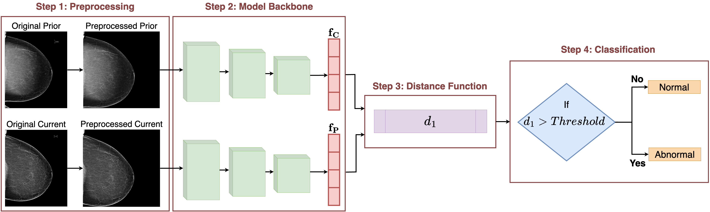
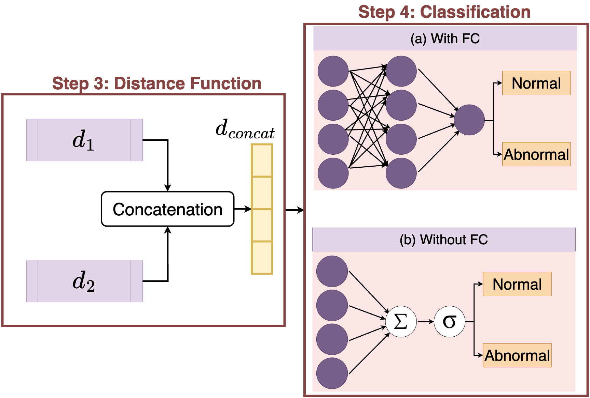

## Benchmarking Distance Functions in Siamese Networks for Accurate Mammogram Image Analysis




 
This repository contains the implementation of our benchmarking methods for the distance functions in the Siamse Network, as described in our paper titled "Benchmarking Distance Functions in Siamese Networks for Accurate Mammogram Image Analysis."

## Contents
1. [Introduction](#introduction)
2. [Installation](#installation)
3. [Usage](#usage)
4. [Datasets](#datasets)

## Introduction

This study investigates the effects of integrating non-linear and correlation-sensitive distance functions into a Siamese network framework for analyzing paired mammogram images (prior and current images for the same patients). The non-linear and correlation-sensitive distance functions aim to improve the network's ability to accurately compare and identify changes in mammogram images over time. By incorporating these functions, the study seeks to enhance the network's performance in detecting subtle differences that may indicate early signs of breast cancer development. 

## Installation

To install and run this project, you will need Python 3.6 or later. Clone the repository and install the necessary requirements:

```bash
[git clone https://github.com/NabaviLab/CAPTURE.git](https://github.com/NabaviLab/Benchmarking_Distance_Functions_in_Siamese_Networks.git)
```
